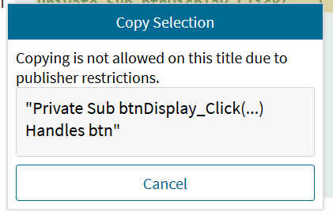
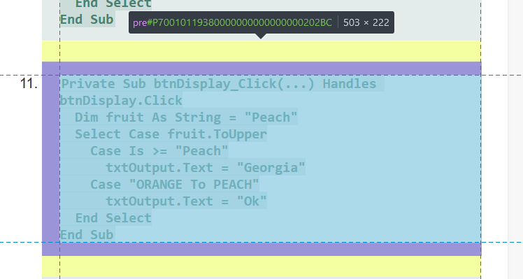
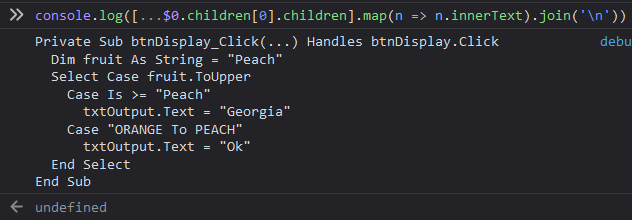

# EZ$$

Not sure what version this is.
I'm pretty sure there were like three before it.
The first instance was the MySpanishLab copy and paste.
Then there was the official first EZ$$ which was for code.org or whatever.
Next came the Java PracticeIts.
This is just basic copying stuff.
I dunno if it qualifies.

If you see this:

Select the `<pre>` that you want to copy from.

Run [this code](./copyTextFromTextbook.js)

Get icced, Redshelf.
