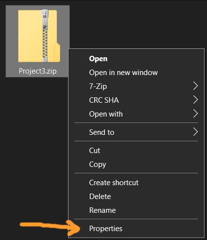
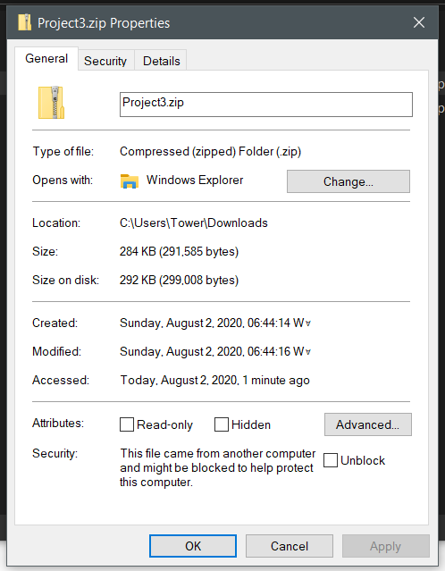
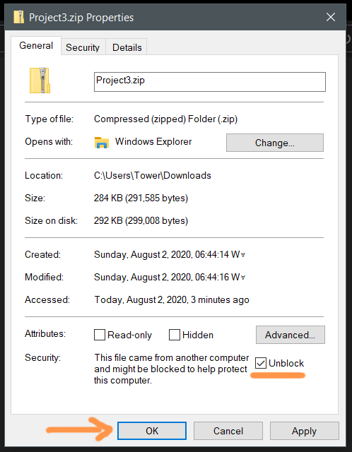

### ZONE CHECK

My files kept getting mark-of-the-web'd.

I'm looking at you, Microsoft.

I finally decided to do something about it.

Here's the message I wrote my prof:

Hi, [professor].
I have finally figured out the mark of the web issue, I hope.
When you or I or anyone else using Windows downloads a file from online,
Windows adds some metadata onto the file (mark of the web).
The reason I didn't have an issue was because the file was already on my computer.
I turned on another computer and tried downloading it.
Here are the steps I took to reproduce the issue:

- I downloaded Project3.zip from Canvas.
- Double Clicked on the Project3.zip which opens it
- Dragged the "Project3" folder onto my desktop to copy
- Open "Project3" folder from desktop and double click "Project3.sln"
- Visual Studio gives me a Security Warning (see attached)
- I hit "OK" (I think here, Visual Studio ignores the mark of the web)
- The project opens fine and I hit run and it's all good

Now for me, it works, but if you have a different version of visual studio or I have different settings,
the Security Warning may not be presented.
Here's an alternative way to open the project that I tested:

- I downloaded Project3.zip from Canvas.
- Right click Project3.zip to show the context menu
- Select Properties at the bottom

- In properties, under general, there might be a "Security" section

- Check the "Unblock" checkbox and press the OK button

- Extract Project3 however you want (I just open it and drag the folder to my desktop)
- Open "Project3" folder from desktop and double click "Project3.sln"
- There is NO security warning (even for me)

I hope this works for you too.
Really sorry that it's blocking my files.
I truly don't know why Windows only does that for me.
