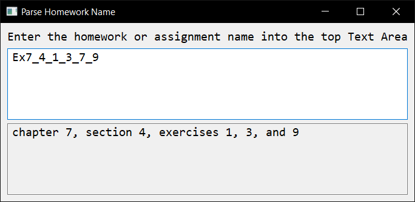

# parseHomeworkName

If you're getting confused by the naming scheme,
I made [parseHomeworkName.exe](parseHomeworkName.exe).
It's pretty cool.
If you don't wanna run a binary from a random person on the internet,
[parseHomeworkName.js](parseHomeworkName.js)
will work just as well.

