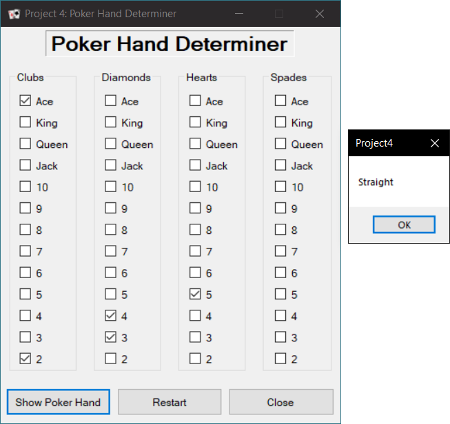

# Project4: Poker Hand Determiner

These messages are about how I feel about this Program.

```text
10:02 PM coalpha: .NET APIs are designed in a way that makes me suspect that
                  the designers get paid every time someone makes a type
                  conversion or does a type cast
10:02 PM coalpha: nonstop boxing and unboxing, Arrays to Lists, Lists to Arrays
                  ... jesus
10:03 PM coalpha: IEnumerables to Lists, IEnumerables to IEnumerators,
                  IEnumerators to Arrays, aaaaaaaaaaa
```




[*spec*](../../Resources/Projects_Students/Project4/Project4_Specifications.pdf)
