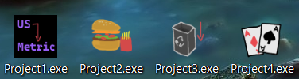

# [course name removed for Search Engine Deoptimization]

## For Cheaters

- If you copy this code for this class, I'm going to remove your skin.
- Do your own work or drop the class.
- Copying people without understanding what's going on is super lame.
- The professor knows about this code, and I've personally reviewed it with him.

## Projects

*The projects on my desktop :)*

1. [Project1: Length Converter](Projects/Project1)
2. [Project2: Fast Food Order Menu](Projects/Project2)
3. [Project3: Depreciation to a Salvage Value of Zero](Projects/Project3)
4. [Project4: Poker Hand Determiner](Projects/Project4)
5. [parseHomeworkName: A native GUI application in Go](Misc/parseHomeworkName)
